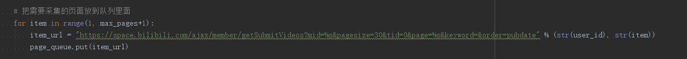

# B站视频爬取

## 简介
通过用户ID爬取用户所有投稿视频信息

本程序所采集用户ID为B站UP主[交通事故video](https://space.bilibili.com/28152409/video) 

**宣扬礼让行车正能量&&不规范行车造成的交通事故**

**道路千万条，安全第一条。开车不规范，亲人两行泪。**


## 编写思路
1. 通过Chrome的[Elements](https://developers.google.com/web/tools/chrome-devtools/css/)和[Network](https://developers.google.com/web/tools/chrome-devtools/network/)分析可知：[B站用户个人中心](https://space.bilibili.com/28152409/video)包含所有投稿视频的数据，同时，该地址具有反爬机制，直接访问将会失败的情况，显示请求更换浏览器等字样。

2. 通过网络请求分析，可知：请求用户全部视频时会通过
```https://space.bilibili.com/ajax/member/getSubmitVideos?mid=28152409&pagesize=30&tid=0&page=1&keyword=&order=pubdate```
返回json数据，并且可知**mid**为用户ID号，**page**参数为页数


3. 通过拼接生成视频链接并且通过队列和多线程爬取视频信息

   

4. 通过csv脱机保存

   
## 使用教程
1.在main中填写用户id和爬取的线程数

```python
    thread_num = 50  # 测试线程数，可以根据自己情况更改
    user_id = 28152409  # 测试账号ID
```

>**注意**
>
>>ID没做异常处理


## 技术路线

* csv
* queue
* threading


## 功能

* [x] 根据[哔哩哔哩](https://www.bilibili.com/)用户ID爬取所有用户投稿视频的信息，通过csv脱机保存


## 完整代码
完整版源代码存放在[github](https://github.com/Bqrookie/project)上，有需要的可以下载
项目持续更新，欢迎您[star本项目](https://github.com/Bqrookie/project)

## Lincense
 [The MIT License (MIT)](http://opensource.org/licenses/MIT)

